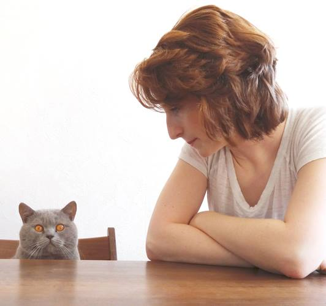

# WILD Emmanuelle
## Web developper junior

  

### Contact me at
67000 STRASBOURG FRANCE  
wild.emmanuelle@gmail.com  
[On LinkedIn](https://www.linkedin.com/in/wild-emmanuelle-webdev "linkedin profile")  

### Personal profile
Hi ! I'm **Emmanuelle**. After 7 years as a caregiver, I decided to take a fresh start. Now, I'm a _Wilder_ on remote bootcamp at Strasbourg's [Wild Code School](https://www.wildcodeschool.com/fr-FR/campus/strasbourg "Strasbourg Wild Code School HomePage"), wanting to become a web developper: the sooner the better.
I'm currently looking for an internship or an opportunity ! 

### Skills
| Hard skills | Soft skills |
|-------------|-------------|
| PHP         | Team  work  |
| MySQL       | Remote work |
| HTML CSS    | Adaptability |
| Bootstrap   | Autonomy    |
| Github      | Priority management |

### Work Experiences
#### Fictitious project for a b&b in Strasbourg
[Stras'Gîte](https://github.com/wild-e/Stras-Gite "Stras'Gîte")
* Use of a MVC pattern
* Use of OOP, and creation of classes and objects
* Making different CRUD
* Connecting to DB using PDO and prepared request
* Securing forms
* Use of a Github workflow

#### Hackathon
[WikiWar](https://github.com/wild-e/WCS-Hackathon-CodingHamsters "WikiWar")
* API consumption and requests

#### Fictitious project n°1
[A CV for Hackerman](https://github.com/wild-e/Project-1--Les-Nous- "Hackerman's CV")
* Pages made out of HTML and CSS
* Implementation of vanilla JS 
* Initiation to github  

### Educationnal history
_2006_ : Baccalauréat English option - **Cambridge FCE** - **Lycée Freppel**, OBERNAI  
_2013_ : Bac+1 - Aide-soignante diplômée d'Etat - **IFSI Saint Vincent**, STRASBOURG  
_2020_ : Bac+2 - web developer - **Wild Code School**, STRASBOURG

### Hobbies
I like to sew, having long walks, doing and going to the theatre, looking for mushrooms in the forest...
